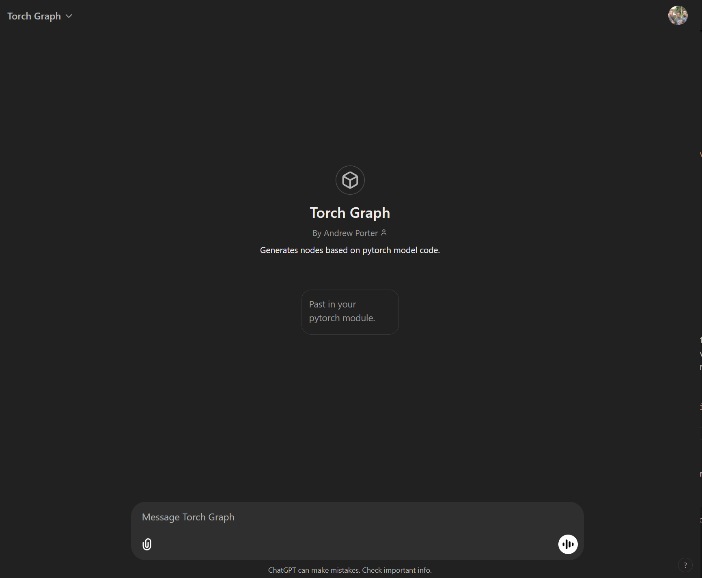
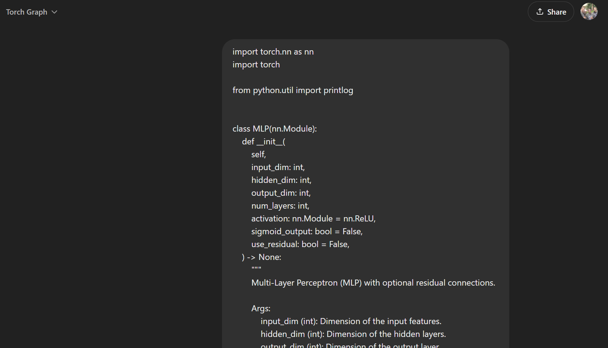
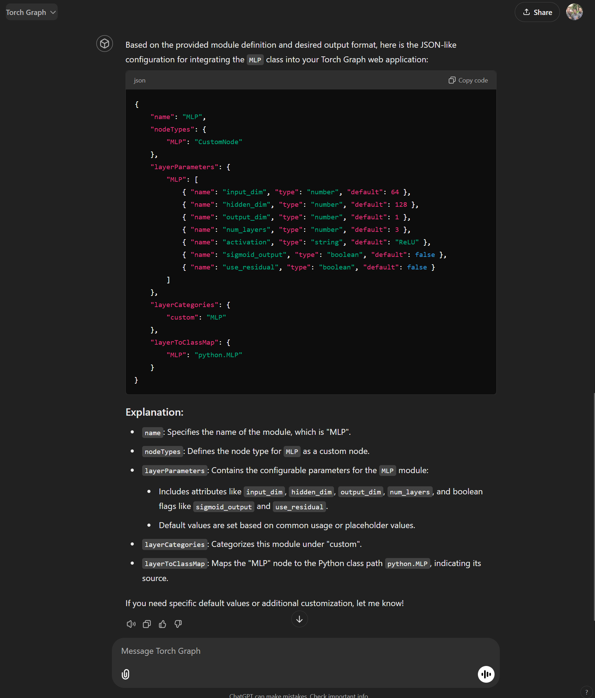
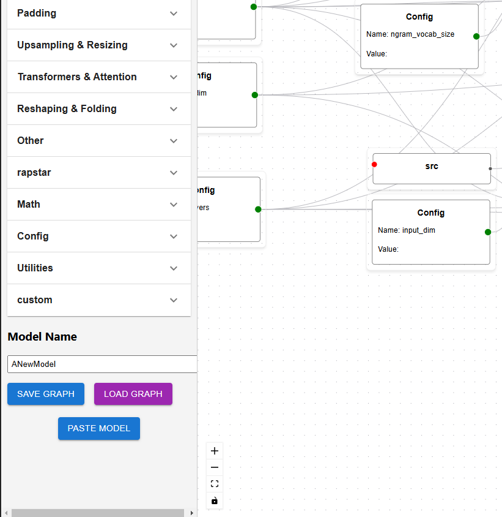

# Torch Graph


Torch Graph is a powerful and intuitive web application designed to visually build and manage PyTorch neural network architectures. By leveraging a graph-based interface, Torch Graph allows users to create complex models with ease, manage parameters dynamically, and generate clean, executable PyTorch code directly from the browser. Whether you're a beginner exploring neural networks or an experienced developer designing intricate models, Torch Graph streamlines the process of model creation and configuration.

## Table of Contents

- [Features](#features)
- [Demo](#demo)
- [Installation](#installation)
- [Available Scripts](#available-scripts)
- [Usage](#usage)
- [Code Generation](#code-generation)
- [Contributing](#contributing)
- [License](#license)
- [Acknowledgments](#acknowledgments)
- [Learn More](#learn-more)

## Features

- **Drag-and-Drop Interface**: Easily add, move, and connect nodes representing different layers and modules of your neural network.
- **Custom Nodes**: Create custom nodes with specific parameters, allowing for flexibility in designing unique architectures.
- **Parameter Management**: Connect parameter nodes to custom nodes to dynamically set and manage layer parameters.
- **Nested Modules**: Support for complex structures like `nn.ModuleList` and `nn.Sequential`, enabling the creation of nested and dynamic layer configurations.
- **Local Storage Integration**: Save, load, and manage multiple graph models directly within the browser without the need for external storage.
- **Code Generation**: Automatically generate clean and executable PyTorch code based on your graph configuration.
- **Responsive Design**: Optimized for various screen sizes, ensuring a seamless experience across devices.
- **User-Friendly UI**: Intuitive design with clear visuals and interactive elements to enhance the user experience.

## Demo


*Screenshot showcasing the Torch Graph interface with custom nodes and parameter connections.*

## Installation

Before you begin, ensure you have met the following requirements:

- **Node.js**: Install the latest LTS version from [Node.js Official Website](https://nodejs.org/).
- **npm or Yarn**: Package managers for installing dependencies.

### Clone the Repository

```bash
git clone https://github.com/mephisto83/torch-graph.git
cd torch-graph
```

### Install Dependencies

Using npm:

```bash
npm install
```

Or using Yarn:

```bash
yarn install
```

## Available Scripts

In the project directory, you can run:

### `npm start` or `yarn start`

Runs the app in the development mode.\
Open [http://localhost:3000](http://localhost:3000) to view it in the browser.

The page will reload if you make edits.\
You will also see any lint errors in the console.

### `npm test` or `yarn test`

Launches the test runner in the interactive watch mode.\
See the section about [running tests](https://facebook.github.io/create-react-app/docs/running-tests) for more information.

### `npm run build` or `yarn build`

Builds the app for production to the `build` folder.\
It correctly bundles React in production mode and optimizes the build for the best performance.

The build is minified and the filenames include the hashes.\
Your app is ready to be deployed!

See the section about [deployment](https://facebook.github.io/create-react-app/docs/deployment) for more information.

### `npm run eject` or `yarn eject`

**Note: this is a one-way operation. Once you `eject`, you can’t go back!**

If you aren’t satisfied with the build tool and configuration choices, you can `eject` at any time. This command will remove the single build dependency from your project.

Instead, it will copy all the configuration files and the transitive dependencies (webpack, Babel, ESLint, etc) right into your project so you have full control over them. All of the commands except `eject` will still work, but they will point to the copied scripts so you can tweak them. At this point you’re on your own.

You don’t have to ever use `eject`. The curated feature set is suitable for small and middle deployments, and you shouldn’t feel obligated to use this feature. However we understand that this tool wouldn’t be useful if you couldn’t customize it when you are ready for it.

## Usage

### Starting the Application

After installing the dependencies, start the development server:

```bash
npm start
```

Or with Yarn:

```bash
yarn start
```

Open [http://localhost:3000](http://localhost:3000) in your browser to interact with Torch Graph.

### Building Your Neural Network

1. **Add Nodes**:
   - Click on the "Add Custom Node" button to add layers like `Linear`, `Conv2d`, etc.
   - Each custom node can have multiple parameter handles based on the `parameterNames` defined.

2. **Add Parameter Nodes**:
   - Click on the "Add Parameter Node" button to create nodes representing parameters.
   - Enter the parameter name (e.g., `in_features`, `out_features`) and set their values.

3. **Connect Nodes**:
   - Drag connections from parameter nodes to the corresponding parameter handles on custom nodes.
   - This dynamically sets the parameters for each layer.

4. **Manage Modules**:
   - Create complex structures like `nn.ModuleList` by adding `ModuleList` nodes and nesting modules within them.

5. **Save and Load Models**:
   - Use the "Save Model" feature to store your graph configurations in Local Storage.
   - Load previously saved models to continue your work or deploy them.

6. **Generate Code**:
   - Once your graph is configured, use the "Generate Code" feature to export clean PyTorch code representing your neural network architecture.

### Example Workflow

1. **Creating a Linear Layer**:
   - Add a `CustomNode` labeled "Linear Layer" with parameters `in_features` and `out_features`.
   - Add two `ParameterNode` instances for `in_features` (e.g., `512`) and `out_features` (e.g., `256`).
   - Connect the parameter nodes to the respective handles on the "Linear Layer" node.

2. **Creating a ModuleList**:
   - Add a `ModuleList` node to manage multiple layers dynamically.
   - Nest multiple `CustomNode` instances within the `ModuleList` for flexibility.

3. **Generating PyTorch Code**:
   - Once the graph is complete, click on "Generate Code" to obtain the corresponding PyTorch implementation.

## Code Generation

Torch Graph not only allows you to design neural networks visually but also generates executable PyTorch code based on your configuration. Here's how it works:

1. **Configuration Class**:
   - A `ModelConfig` class is generated to store all tunable parameters.
   - Parameters are uniquely named to prevent conflicts.

2. **Model Class**:
   - A PyTorch `nn.Module` class is created based on the graph structure.
   - Layers are initialized with parameters from the `ModelConfig`.
   - The `forward` method defines the data flow through the network.

3. **Handling Nested Structures**:
   - Complex structures like `nn.ModuleList` and `nn.Sequential` are accurately represented in the generated code.
   - Nested modules are handled recursively to ensure correct initialization and data flow.

### Sample Generated Code

```python
import torch
import torch.nn as nn

class ModelConfig:
    def __init__(self):
        self.Linear_Layer_in_features = 512
        self.Linear_Layer_out_features = 256

        # Dependent properties
        self.calculate_dependent_properties()

    def calculate_dependent_properties(self):
        pass

class Model(nn.Module):
    def __init__(self, config):
        super(Model, self).__init__()
        self.config = config
        self.Linear_Layer = nn.Linear(
            in_features=config.Linear_Layer_in_features,
            out_features=config.Linear_Layer_out_features
        )

    def forward(self, input):
        Linear_Layer_output = self.Linear_Layer(input)
        return Linear_Layer_output
```

## Using Torch Graph GPT to Generate Customized Modules

Creating customized neural network modules can be a complex and time-consuming task, especially when dealing with intricate architectures and numerous configuration parameters. To streamline this process, **Torch Graph GPT** offers an innovative solution that leverages the power of AI to generate tailored configurations for your PyTorch modules. This section will guide you through using Torch Graph GPT to effortlessly create customized modules, enhancing your model development workflow.

### **What is Torch Graph GPT?**

**Torch Graph GPT** is an AI-powered tool designed to simplify the creation and customization of PyTorch modules. By analyzing your existing module code, Torch Graph GPT generates a corresponding configuration that can be seamlessly integrated into your neural network composer or codebase. This enables you to manage module configurations more efficiently, ensuring consistency and reducing the potential for errors.

### **Accessing Torch Graph GPT**

To utilize Torch Graph GPT, navigate to the following URL:

🔗 [https://chatgpt.com/g/g-6753864b46148191817e5381ba51e76a-torch-graph](https://chatgpt.com/g/g-6753864b46148191817e5381ba51e76a-torch-graph)

*Note: Ensure you have a stable internet connection and the necessary permissions to access external web tools.*

### **Step-by-Step Guide to Generating Customized Module Configurations**

Follow these steps to generate a customized configuration for your PyTorch module using Torch Graph GPT:

#### **1. Prepare Your PyTorch Module Code**

Before you begin, ensure that your PyTorch module code is clean, well-documented, and free of syntax errors. A well-structured module facilitates more accurate configuration generation.

**Example PyTorch Module:**

```python
import torch
import torch.nn as nn

class CustomLinearLayer(nn.Module):
    def __init__(self, in_features, out_features, bias=True):
        super(CustomLinearLayer, self).__init__()
        self.linear = nn.Linear(in_features, out_features, bias)
        self.activation = nn.ReLU()

    def forward(self, x):
        out = self.linear(x)
        out = self.activation(out)
        return out
```

#### **2. Navigate to Torch Graph GPT**

Open your web browser and go to the Torch Graph GPT interface:

🔗 [https://chatgpt.com/g/g-6753864b46148191817e5381ba51e76a-torch-graph](https://chatgpt.com/g/g-6753864b46148191817e5381ba51e76a-torch-graph)

#### **3. Paste Your Module Code**

Once on the Torch Graph GPT page:

1. **Locate the Input Field:** You'll find a designated area or text box where you can input your module code.
2. **Paste the Code:** Copy your PyTorch module code and paste it into the input field.

**Example:**



#### **4. Submit for Configuration Generation**

After pasting your code:

1. **Initiate the Process:** Click on the "Submit" button or a similarly labeled action to start the configuration generation process.
2. **Wait for Processing:** The AI will analyze your module code, identify key components, and generate a corresponding configuration.

**Progress Indicator:**





#### **5. Review and Download the Generated Configuration**

Once the process is complete:

1. **View the Configuration:** The generated JSON configuration will be displayed on the screen.
2. **Verify Accuracy:** Ensure that all parameters, such as `in_features`, `out_features`, and `activation`, are correctly captured.
3. **Download the Config:** Click on the "Copy" button to save the configuration file to your clipboard.

**Example Generated YAML Configuration:**

```json
{
    "name": "MLP",
    "nodeTypes": {
        "MLP": "CustomNode"
    },
    "layerParameters": {
        "MLP": [
            { "name": "input_dim", "type": "number", "default": 64 },
            { "name": "hidden_dim", "type": "number", "default": 128 },
            { "name": "output_dim", "type": "number", "default": 1 },
            { "name": "num_layers", "type": "number", "default": 3 },
            { "name": "activation", "type": "string", "default": "ReLU" },
            { "name": "sigmoid_output", "type": "boolean", "default": false },
            { "name": "use_residual", "type": "boolean", "default": false }
        ]
    },
    "layerCategories": {
        "custom": "MLP"
    },
    "layerToClassMap": {
        "MLP": "python.MLP"
    }
}

```

#### **6. Integrate the Configuration into Your Workflow**

With the configuration file ready:

1. **Import the Configuration:** Click the paste button to import the JSON.
2. **Instantiate the Module:** The configuration will automatically set the parameters for your custom module.




### **Best Practices for Using Torch Graph GPT**

To maximize the effectiveness of Torch Graph GPT, consider the following best practices:

1. **Maintain Clean Code:** Ensure that your module code is free from syntax errors and follows standard coding conventions.
2. **Use Descriptive Names:** Clearly name your classes and parameters to aid the AI in accurately generating configurations.
3. **Document Your Modules:** Include comments and docstrings within your module code to provide context, enhancing the accuracy of the generated config.
4. **Review Generated Configurations:** Always review the AI-generated configurations for correctness and completeness before integrating them into your projects.
5. **Update Regularly:** Keep Torch Graph GPT updated to benefit from the latest improvements and features.

### **Troubleshooting Common Issues**

While Torch Graph GPT is designed to be user-friendly and efficient, you might encounter occasional issues. Here are some common problems and their solutions:

#### **1. Incomplete or Missing Parameters**

**Issue:** The generated configuration lacks certain parameters present in your module.

**Solution:**

- **Ensure Parameter Exposure:** Make sure all necessary parameters are defined in the `__init__` method of your module.
- **Avoid Dynamic Parameters:** Parameters that are dynamically generated within methods (not in `__init__`) might not be detected.

**Example Correction:**

```python
# Ensure all parameters are in __init__
class CustomLinearLayer(nn.Module):
    def __init__(self, in_features, out_features, bias=True):
        super(CustomLinearLayer, self).__init__()
        self.linear = nn.Linear(in_features, out_features, bias)
        self.activation = nn.ReLU()
```

#### **2. Incorrect Parameter Values**

**Issue:** Parameters in the configuration have incorrect default values or data types.

**Solution:**

- **Validate Your Module Code:** Double-check the parameter values and data types in your module.
- **Provide Explicit Defaults:** Explicitly set default values for all parameters to guide the AI in generating accurate configurations.

#### **3. Unsupported Components**

**Issue:** The AI fails to recognize or correctly configure custom or advanced PyTorch components.

**Solution:**

- **Simplify Complex Components:** Break down complex modules into simpler sub-components.
- **Manually Adjust Configurations:** After generation, manually edit the configuration to include advanced settings or custom components.

### **Example Workflow**

Let's walk through a complete example to illustrate the process.

#### **1. Define a Custom PyTorch Module**

```python
import torch
import torch.nn as nn

class CustomConvBlock(nn.Module):
    def __init__(self, in_channels, out_channels, kernel_size=3, stride=1, padding=1, activation=nn.ReLU()):
        super(CustomConvBlock, self).__init__()
        self.conv = nn.Conv2d(in_channels, out_channels, kernel_size, stride, padding)
        self.bn = nn.BatchNorm2d(out_channels)
        self.activation = activation

    def forward(self, x):
        out = self.conv(x)
        out = self.bn(out)
        out = self.activation(out)
        return out
```

#### **2. Generate Configuration Using Torch Graph GPT**

1. **Paste the Module Code:** Navigate to Torch Graph GPT and paste the `CustomConvBlock` code.
2. **Generate Config:** Click "Generate Config" to produce the YAML configuration.

**Generated YAML Configuration (`customconvblock_defaults.yaml`):**

```yaml
CustomConvBlock:
  in_channels: 64
  out_channels: 128
  kernel_size: 3
  stride: 1
  padding: 1
  activation: nn.ReLU()
```

#### **3. Integrate the Configuration into Your Project**

**`model_builder.py`:**

```python
import yaml
import torch.nn as nn
from your_composer import NeuralNetworkComposer

class CustomConvBlock(nn.Module):
    def __init__(self, in_channels, out_channels, kernel_size=3, stride=1, padding=1, activation=nn.ReLU()):
        super(CustomConvBlock, self).__init__()
        self.conv = nn.Conv2d(in_channels, out_channels, kernel_size, stride, padding)
        self.bn = nn.BatchNorm2d(out_channels)
        self.activation = activation

    def forward(self, x):
        out = self.conv(x)
        out = self.bn(out)
        out = self.activation(out)
        return out

def load_config_from_yaml(yaml_path: str) -> dict:
    with open(yaml_path, 'r') as file:
        config_dict = yaml.safe_load(file)
    
    # Handle activation function instantiation
    activation_str = config_dict['CustomConvBlock'].pop('activation')
    activation_mapping = {
        'nn.ReLU()': nn.ReLU(),
        # Add more mappings as needed
    }
    
    if activation_str in activation_mapping:
        config_dict['CustomConvBlock']['activation'] = activation_mapping[activation_str]
    else:
        raise ValueError(f"Unsupported activation function: {activation_str}")
    
    return config_dict

if __name__ == "__main__":
    # Load configuration from YAML
    config = load_config_from_yaml('customconvblock_defaults.yaml')
    
    # Instantiate the Neural Network Composer
    composer = NeuralNetworkComposer(config)
    
    # Add the custom convolutional block to your model
    composer.add_layer('CustomConvBlock')
    
    # Build and retrieve the model
    model = composer.build_model()
    
    # Example input tensor
    x = torch.randn(1, 64, 224, 224)
    
    # Forward pass
    output = model(x)
    print(output.shape)
```

**Explanation:**

1. **Loading Configuration:**
    - The `load_config_from_yaml` function reads the YAML file and maps the `activation` string to the actual `nn.ReLU()` instance.

2. **Instantiating the Composer:**
    - The `NeuralNetworkComposer` (assumed to be part of your framework) utilizes the configuration to add and configure the `CustomConvBlock`.

3. **Building and Using the Model:**
    - The model is built using the composer, and a forward pass is demonstrated with a sample input tensor.

### **Advantages of Using Torch Graph GPT**

- **Efficiency:** Rapidly generate accurate configurations without manual intervention.
- **Consistency:** Maintain uniform configurations across different modules and projects.
- **Scalability:** Easily manage complex models with numerous interdependent parameters.
- **Error Reduction:** Minimize human errors in configuration through AI-assisted generation.

### **Conclusion**

Torch Graph GPT is a powerful tool that significantly simplifies the process of creating and managing customized PyTorch modules. By automating the generation of configuration files and providing seamless integration with your development workflow, it allows you to focus more on designing innovative models and less on the intricacies of configuration management. Embrace Torch Graph GPT to enhance your model development efficiency, maintain consistency, and ensure scalability in your machine learning projects.

If you encounter any issues or have further questions about using Torch Graph GPT, feel free to consult the [Torch Graph GPT Documentation](https://chatgpt.com/g/g-6753864b46148191817e5381ba51e76a-torch-graph) or reach out to the support team for assistance.

## Contributing

Contributions are what make the open-source community such an amazing place to learn, inspire, and create. Any contributions you make are **greatly appreciated**.

1. **Fork the Project**: Click the fork button on the repository to create your own copy.
2. **Clone the Repository**:

    ```bash
    git clone https://github.com/yourusername/torch-graph.git
    cd torch-graph
    ```

3. **Create a Branch**:

    ```bash
    git checkout -b feature/AmazingFeature
    ```

4. **Commit Your Changes**:

    ```bash
    git commit -m "Add some AmazingFeature"
    ```

5. **Push to the Branch**:

    ```bash
    git push origin feature/AmazingFeature
    ```

6. **Open a Pull Request**: Navigate to the repository on GitHub and open a pull request.

## License

Distributed under the MIT License. See `LICENSE` for more information.

## Acknowledgments

- [React](https://reactjs.org/)
- [React Flow](https://reactflow.dev/)
- [Material-UI (MUI)](https://mui.com/)
- [Create React App](https://github.com/facebook/create-react-app)
- [PyTorch](https://pytorch.org/)
- [OpenAI](https://openai.com/)
- [Others](https://github.com/yourusername/torch-graph/graphs/contributors)

## Learn More

You can learn more in the [Create React App documentation](https://facebook.github.io/create-react-app/docs/getting-started).

To learn React, check out the [React documentation](https://reactjs.org/).

For more information on React Flow, visit the [React Flow documentation](https://reactflow.dev/docs/introduction/).

---

*Feel free to reach out if you have any questions or need further assistance! Happy modeling with Torch Graph!*