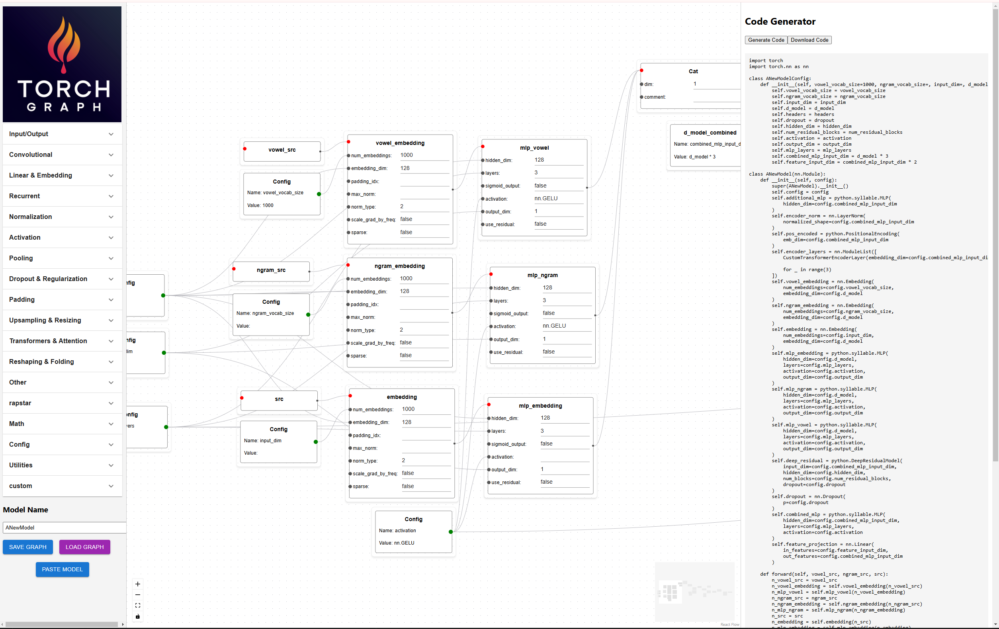

# Torch Graph


Torch Graph is a powerful and intuitive web application designed to visually build and manage PyTorch neural network architectures. By leveraging a graph-based interface, Torch Graph allows users to create complex models with ease, manage parameters dynamically, and generate clean, executable PyTorch code directly from the browser. Whether you're a beginner exploring neural networks or an experienced developer designing intricate models, Torch Graph streamlines the process of model creation and configuration.

## Table of Contents

- [Features](#features)
- [Demo](#demo)
- [Installation](#installation)
- [Available Scripts](#available-scripts)
- [Usage](#usage)
- [Code Generation](#code-generation)
- [Contributing](#contributing)
- [License](#license)
- [Acknowledgments](#acknowledgments)
- [Learn More](#learn-more)

## Features

- **Drag-and-Drop Interface**: Easily add, move, and connect nodes representing different layers and modules of your neural network.
- **Custom Nodes**: Create custom nodes with specific parameters, allowing for flexibility in designing unique architectures.
- **Parameter Management**: Connect parameter nodes to custom nodes to dynamically set and manage layer parameters.
- **Nested Modules**: Support for complex structures like `nn.ModuleList` and `nn.Sequential`, enabling the creation of nested and dynamic layer configurations.
- **Local Storage Integration**: Save, load, and manage multiple graph models directly within the browser without the need for external storage.
- **Code Generation**: Automatically generate clean and executable PyTorch code based on your graph configuration.
- **Responsive Design**: Optimized for various screen sizes, ensuring a seamless experience across devices.
- **User-Friendly UI**: Intuitive design with clear visuals and interactive elements to enhance the user experience.

## Demo



*Screenshot showcasing the Torch Graph interface with custom nodes and parameter connections.*

## Installation

Before you begin, ensure you have met the following requirements:

- **Node.js**: Install the latest LTS version from [Node.js Official Website](https://nodejs.org/).
- **npm or Yarn**: Package managers for installing dependencies.

### Clone the Repository

```bash
git clone https://github.com/mephisto83/torch-graph.git
cd torch-graph
```

### Install Dependencies

Using npm:

```bash
npm install
```

Or using Yarn:

```bash
yarn install
```

## Available Scripts

In the project directory, you can run:

### `npm start` or `yarn start`

Runs the app in the development mode.\
Open [http://localhost:3000](http://localhost:3000) to view it in the browser.

The page will reload if you make edits.\
You will also see any lint errors in the console.

### `npm test` or `yarn test`

Launches the test runner in the interactive watch mode.\
See the section about [running tests](https://facebook.github.io/create-react-app/docs/running-tests) for more information.

### `npm run build` or `yarn build`

Builds the app for production to the `build` folder.\
It correctly bundles React in production mode and optimizes the build for the best performance.

The build is minified and the filenames include the hashes.\
Your app is ready to be deployed!

See the section about [deployment](https://facebook.github.io/create-react-app/docs/deployment) for more information.

### `npm run eject` or `yarn eject`

**Note: this is a one-way operation. Once you `eject`, you can’t go back!**

If you aren’t satisfied with the build tool and configuration choices, you can `eject` at any time. This command will remove the single build dependency from your project.

Instead, it will copy all the configuration files and the transitive dependencies (webpack, Babel, ESLint, etc) right into your project so you have full control over them. All of the commands except `eject` will still work, but they will point to the copied scripts so you can tweak them. At this point you’re on your own.

You don’t have to ever use `eject`. The curated feature set is suitable for small and middle deployments, and you shouldn’t feel obligated to use this feature. However we understand that this tool wouldn’t be useful if you couldn’t customize it when you are ready for it.

## Usage

### Starting the Application

After installing the dependencies, start the development server:

```bash
npm start
```

Or with Yarn:

```bash
yarn start
```

Open [http://localhost:3000](http://localhost:3000) in your browser to interact with Torch Graph.

### Building Your Neural Network

1. **Add Nodes**:
   - Click on the "Add Custom Node" button to add layers like `Linear`, `Conv2d`, etc.
   - Each custom node can have multiple parameter handles based on the `parameterNames` defined.

2. **Add Parameter Nodes**:
   - Click on the "Add Parameter Node" button to create nodes representing parameters.
   - Enter the parameter name (e.g., `in_features`, `out_features`) and set their values.

3. **Connect Nodes**:
   - Drag connections from parameter nodes to the corresponding parameter handles on custom nodes.
   - This dynamically sets the parameters for each layer.

4. **Manage Modules**:
   - Create complex structures like `nn.ModuleList` by adding `ModuleList` nodes and nesting modules within them.

5. **Save and Load Models**:
   - Use the "Save Model" feature to store your graph configurations in Local Storage.
   - Load previously saved models to continue your work or deploy them.

6. **Generate Code**:
   - Once your graph is configured, use the "Generate Code" feature to export clean PyTorch code representing your neural network architecture.

### Example Workflow

1. **Creating a Linear Layer**:
   - Add a `CustomNode` labeled "Linear Layer" with parameters `in_features` and `out_features`.
   - Add two `ParameterNode` instances for `in_features` (e.g., `512`) and `out_features` (e.g., `256`).
   - Connect the parameter nodes to the respective handles on the "Linear Layer" node.

2. **Creating a ModuleList**:
   - Add a `ModuleList` node to manage multiple layers dynamically.
   - Nest multiple `CustomNode` instances within the `ModuleList` for flexibility.

3. **Generating PyTorch Code**:
   - Once the graph is complete, click on "Generate Code" to obtain the corresponding PyTorch implementation.

## Code Generation

Torch Graph not only allows you to design neural networks visually but also generates executable PyTorch code based on your configuration. Here's how it works:

1. **Configuration Class**:
   - A `ModelConfig` class is generated to store all tunable parameters.
   - Parameters are uniquely named to prevent conflicts.

2. **Model Class**:
   - A PyTorch `nn.Module` class is created based on the graph structure.
   - Layers are initialized with parameters from the `ModelConfig`.
   - The `forward` method defines the data flow through the network.

3. **Handling Nested Structures**:
   - Complex structures like `nn.ModuleList` and `nn.Sequential` are accurately represented in the generated code.
   - Nested modules are handled recursively to ensure correct initialization and data flow.

### Sample Generated Code

```python
import torch
import torch.nn as nn

class ModelConfig:
    def __init__(self):
        self.Linear_Layer_in_features = 512
        self.Linear_Layer_out_features = 256

        # Dependent properties
        self.calculate_dependent_properties()

    def calculate_dependent_properties(self):
        pass

class Model(nn.Module):
    def __init__(self, config):
        super(Model, self).__init__()
        self.config = config
        self.Linear_Layer = nn.Linear(
            in_features=config.Linear_Layer_in_features,
            out_features=config.Linear_Layer_out_features
        )

    def forward(self, input):
        Linear_Layer_output = self.Linear_Layer(input)
        return Linear_Layer_output
```

## Contributing

Contributions are what make the open-source community such an amazing place to learn, inspire, and create. Any contributions you make are **greatly appreciated**.

1. **Fork the Project**: Click the fork button on the repository to create your own copy.
2. **Clone the Repository**:

    ```bash
    git clone https://github.com/yourusername/torch-graph.git
    cd torch-graph
    ```

3. **Create a Branch**:

    ```bash
    git checkout -b feature/AmazingFeature
    ```

4. **Commit Your Changes**:

    ```bash
    git commit -m "Add some AmazingFeature"
    ```

5. **Push to the Branch**:

    ```bash
    git push origin feature/AmazingFeature
    ```

6. **Open a Pull Request**: Navigate to the repository on GitHub and open a pull request.

## License

Distributed under the MIT License. See `LICENSE` for more information.

## Acknowledgments

- [React](https://reactjs.org/)
- [React Flow](https://reactflow.dev/)
- [Material-UI (MUI)](https://mui.com/)
- [Create React App](https://github.com/facebook/create-react-app)
- [PyTorch](https://pytorch.org/)
- [OpenAI](https://openai.com/)
- [Others](https://github.com/yourusername/torch-graph/graphs/contributors)

## Learn More

You can learn more in the [Create React App documentation](https://facebook.github.io/create-react-app/docs/getting-started).

To learn React, check out the [React documentation](https://reactjs.org/).

For more information on React Flow, visit the [React Flow documentation](https://reactflow.dev/docs/introduction/).

---

*Feel free to reach out if you have any questions or need further assistance! Happy modeling with Torch Graph!*